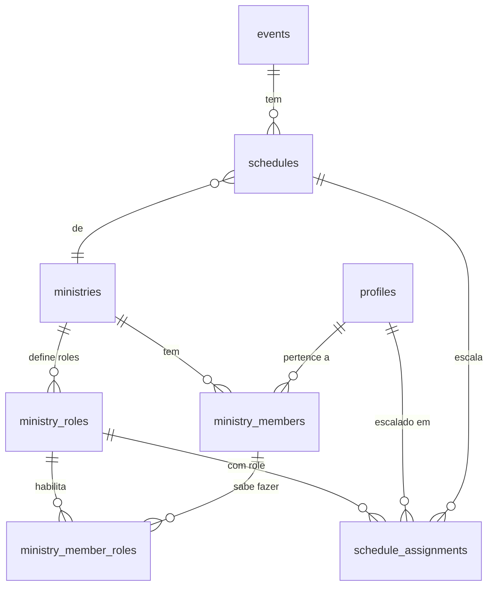

# Modelo de Escalas, Roles e Detecção de Conflitos

> [!IMPORTANT]
> **Princípio**: Regras de negócio vivem na camada de serviços (`src/services/`), nunca no banco de dados.  
> SQL functions/triggers somente em último caso (ver `system_design.md` seção 2).

---

## 1. Dois conceitos distintos: Capability vs Assignment

| Conceito | O que é | Onde vive | Quem gerencia |
|---|---|---|---|
| **Capability** | O que o membro *sabe fazer* | `ministry_member_roles` | Líder do ministério |
| **Assignment** | O que o membro *vai fazer* num evento | `schedule_assignments` | Líder ao montar a escala |

### Exemplo concreto

João participa de 3 ministérios:

```
Capabilities (estáticas):
  Louvor:     Guitarra, Baixo, Back Vocal
  Mídia:      Fotografia
  Diaconato:  Portaria, Porta do Templo

Assignments (por evento):
  Domingo 23/03 10h → Louvor → Guitarra
  Quarta  26/03 19h → Mídia  → Fotografia
  Quinta  27/03 19h → Louvor → Baixo
```

As capabilities são **o catálogo** do que o líder pode escolher ao escalar. O assignment é **a escolha feita** para um evento específico.

---

## 2. Modelo de dados

### Fluxo de relacionamento



### Tabelas envolvidas

#### `ministry_members` — membership (pertence ao ministério)

```sql
CREATE TABLE public.ministry_members (
  id          UUID PRIMARY KEY DEFAULT gen_random_uuid(),
  ministry_id UUID NOT NULL REFERENCES ministries(id) ON DELETE CASCADE,
  user_id     UUID NOT NULL REFERENCES profiles(id) ON DELETE CASCADE,
  is_leader   BOOLEAN NOT NULL DEFAULT false,
  joined_at   TIMESTAMPTZ NOT NULL DEFAULT now(),
  UNIQUE(ministry_id, user_id)  -- um membro pertence UMA vez a cada ministério
);
```

> **Sem `role_id` aqui.** A membership é apenas "João faz parte do Louvor". As roles ficam na tabela abaixo.

#### `ministry_member_roles` — capabilities (sabe exercer)

```sql
CREATE TABLE public.ministry_member_roles (
  id        UUID PRIMARY KEY DEFAULT gen_random_uuid(),
  member_id UUID NOT NULL REFERENCES ministry_members(id) ON DELETE CASCADE,
  role_id   UUID NOT NULL REFERENCES ministry_roles(id) ON DELETE CASCADE,
  UNIQUE(member_id, role_id)  -- não duplica capability
);
```

Exemplo de dados:
```
member: (João, Louvor) → roles: Guitarra, Baixo, Back Vocal
member: (João, Mídia)  → roles: Fotografia
```

#### `schedule_assignments` — assignment (escalado para um evento)

```sql
CREATE TABLE public.schedule_assignments (
  id           UUID PRIMARY KEY DEFAULT gen_random_uuid(),
  schedule_id  UUID NOT NULL REFERENCES schedules(id) ON DELETE CASCADE,
  user_id      UUID NOT NULL REFERENCES profiles(id) ON DELETE CASCADE,
  role_id      UUID NOT NULL REFERENCES ministry_roles(id),
  status       TEXT NOT NULL DEFAULT 'pending'
               CHECK (status IN ('pending', 'confirmed', 'declined', 'swapped')),
  confirmed_at TIMESTAMPTZ,
  created_at   TIMESTAMPTZ NOT NULL DEFAULT now(),
  UNIQUE(schedule_id, user_id, role_id)  -- permite múltiplas roles no mesmo schedule
);
```

> **UNIQUE mudou** de `(schedule_id, user_id)` para `(schedule_id, user_id, role_id)` — João pode tocar guitarra E fazer back vocal no mesmo culto.

---

## 3. Fluxo de escalação (passo a passo)

```
1. Admin cria Ministério (ex: Louvor)
2. Admin/Líder cria Roles do ministério (Guitarra, Baixo, Vocal, etc.)
3. Líder adiciona Membro ao ministério (ministry_members)
4. Líder marca quais roles o membro sabe exercer (ministry_member_roles)
5. Admin cria Evento (ex: Culto Domingo 10h)
6. Líder cria Schedule do seu ministério para o evento (schedules)
7. Líder escala membro com role específica (schedule_assignments)
   │
   └─ Service verifica ANTES de criar:
      ├─ Membro tem capability para essa role? → rejeitar se não
      ├─ Membro bloqueou essa data? → avisar líder
      └─ Membro já está escalado em outro ministério nesse horário? → WARNING
```

---

## 4. Detecção de conflitos entre ministérios

### O problema

Dois líderes de ministérios diferentes podem escalar o mesmo membro no mesmo horário sem saber:

```
Líder do Louvor:  "João, guitarra no Domingo 10h"  ✅ criado
Líder da Mídia:   "João, fotografia no Domingo 10h" ⚠️ CONFLITO
```

### A solução: soft block (warning, não bloqueio)

O conflito **NÃO impede** a escalação — é um **aviso** para o líder decidir. Existem casos legítimos:
- Membro opera slides (Mídia) E participa do louvor no mesmo culto
- Membro faz recepção antes do culto E toca durante o culto (horários se sobrepõem parcialmente)

### Implementação no service layer

```ts
// src/services/scheduleService.ts

async function checkSchedulingConflicts(
  userId: string,
  eventId: string
): Promise<ConflictWarning[]> {
  // 1. Busca dados do evento onde está sendo escalado
  const event = await getEvent(eventId);

  // 2. Busca TODAS as assignments ativas do user
  const { data: assignments } = await supabase
    .from('schedule_assignments')
    .select(`
      id, status,
      role:ministry_roles(name),
      schedule:schedules(
        ministry:ministries(name),
        event:events(id, title, start_at, end_at)
      )
    `)
    .eq('user_id', userId)
    .neq('status', 'declined');

  // 3. Filtra por sobreposição de horário
  return assignments
    .filter(a => {
      const e = a.schedule.event;
      return e.id !== eventId
        && e.start_at < event.end_at
        && e.end_at > event.start_at;
    })
    .map(a => ({
      eventTitle: a.schedule.event.title,
      ministry: a.schedule.ministry.name,
      role: a.role.name,
      startAt: a.schedule.event.start_at,
      endAt: a.schedule.event.end_at,
    }));
}

// Uso pelo líder:
async function assignMember(scheduleId, userId, roleId) {
  // Verifica capability
  const hasCapability = await checkCapability(userId, roleId);
  if (!hasCapability) throw new Error('Membro não tem essa função');

  // Verifica blocked dates
  const blockedDates = await checkBlockedDates(userId, eventDate);

  // Verifica conflitos
  const conflicts = await checkSchedulingConflicts(userId, eventId);

  return {
    blockedDates,
    conflicts,
    // Front-end mostra warnings e pede confirmação do líder
  };
}
```

### UX esperada

Quando o líder tenta escalar e há conflito:

```
┌─────────────────────────────────────────┐
│  ⚠️ Aviso de conflito                   │
│                                         │
│  João já está escalado em:              │
│  📋 Louvor → Guitarra                   │
│     Culto Domingo, 10:00 - 12:00       │
│                                         │
│  Deseja escalar mesmo assim?            │
│                                         │
│  [ Cancelar ]        [ Escalar Mesmo ]  │
└─────────────────────────────────────────┘
```

---

## 5. Cada ministério tem roles completamente diferentes

A tabela `ministry_roles` já é genérica — cada ministério cadastra suas próprias roles:

```
Louvor:     Vocal, Back Vocal, Ministrar, Violão, Guitarra, Baixo, Bateria, Teclado
Diaconato:  Portaria, Porta do Templo, Corredor, Estacionamento
Mídia:      Câmera, Fotografia, Transmissão, Slides
Infantil:   Professor, Auxiliar
```

Não existe um enum global. Se o ministério de Diaconato precisa de "Portaria", ele cria. Se o Louvor precisa de "Ministrar" (cantor principal), ele cria. Totalmente dinâmico.

---

## 6. Edge cases documentados

| Caso | Comportamento |
|---|---|
| Líder escala membro sem capability | Service rejeita — membro não tem essa role |
| Líder escala membro em data bloqueada | Warning (soft block) — líder decide |
| Membro escalado em 2 ministérios no mesmo horário | Warning (soft block) — líder decide |
| Membro escalado com 2 roles no mesmo ministério/evento | Permitido (ex: guitarra + back vocal) |
| Membro removido do ministério | CASCADE: remove capabilities E assignments pendentes |
| Role deletada do ministério | CASCADE: remove de capabilities E assignments |
| Membro declina assignment | Status muda para `declined`, líder é notificado |
| Membro pede swap | `swap_requests` criada, líder procura substituto |
