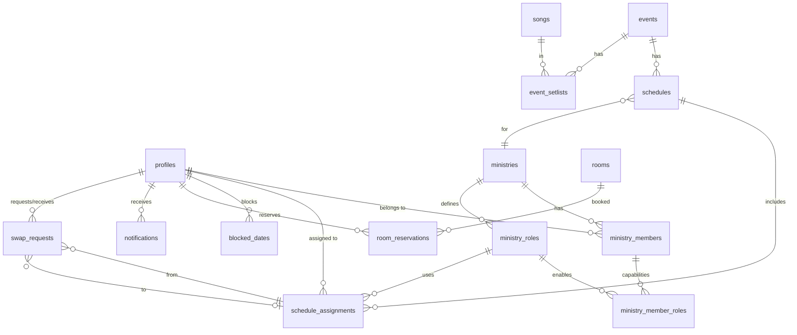

# MJCP — System Design & Implementation Plan

## 📋 Project Analysis Summary

**MJCP** is a church ministry management mobile app built with React Native (Expo SDK 54). It manages **members**, **ministry areas**, **service schedules**, and **member assignments**.

### Current State

| Area | Status |
|---|---|
| UI Screens | ✅ 9 screens implemented (all with mock data) |
| Navigation | ✅ Stack + Bottom Tabs (5 tabs) working |
| Design System | ✅ Material Design 3 + NativeWind + Lucide icons |
| YouTube Integration | ✅ Carousel with YouTube Data API v3 |
| Auth Screens | ⚠️ Created but commented out of navigator |
| Backend / API | ❌ No backend — all data is hardcoded |
| Authentication | ❌ No real auth |
| State Management | ❌ No global state |
| Persistence | ❌ No data persistence |

### Screens Completed (UI only)

| Screen | Features |
|---|---|
| HomeScreen | Dashboard hub: 4 MiniCards, next schedule, next events, YouTube carousel |
| MySchedulesScreen | FlatList + search + filter (current/past) + pagination mock |
| EventsScreen | FlatList + search + 3 filters + pagination mock |
| EventDetailsScreen | Event info + team roster + confirm/swap buttons |
| MusicScreen | Song catalog + categories + search + setlist card |
| RoomsScreen | Date/time selector + room cards + reserve action |
| BlockDatesScreen | Calendar multi-select + block action |
| ProfileScreen | Avatar + info + activities carousel + bottom-sheet menu |
| EditProfileScreen | Avatar upload button + name/email/phone fields |

---

## 1️⃣ Database Schema

### Entity-Relationship Diagram



### Tables

#### `profiles` — extends Supabase `auth.users`

```sql
CREATE TABLE public.profiles (
  id          UUID PRIMARY KEY REFERENCES auth.users(id) ON DELETE CASCADE,
  full_name   TEXT NOT NULL,
  email       TEXT NOT NULL,
  phone       TEXT,
  avatar_url  TEXT,
  role        TEXT NOT NULL DEFAULT 'member' CHECK (role IN ('admin', 'leader', 'member')),
  created_at  TIMESTAMPTZ NOT NULL DEFAULT now(),
  updated_at  TIMESTAMPTZ NOT NULL DEFAULT now()
);
```

#### `ministries`

```sql
CREATE TABLE public.ministries (
  id          UUID PRIMARY KEY DEFAULT gen_random_uuid(),
  name        TEXT NOT NULL UNIQUE,
  description TEXT,
  color       TEXT DEFAULT '#000000',  -- UI color identifier
  created_at  TIMESTAMPTZ NOT NULL DEFAULT now()
);
```

#### `ministry_roles` — dynamic roles per ministry

```sql
CREATE TABLE public.ministry_roles (
  id          UUID PRIMARY KEY DEFAULT gen_random_uuid(),
  ministry_id UUID NOT NULL REFERENCES ministries(id) ON DELETE CASCADE,
  name        TEXT NOT NULL,  -- e.g. "Vocal", "Guitar", "Drums"
  created_at  TIMESTAMPTZ NOT NULL DEFAULT now(),
  UNIQUE(ministry_id, name)
);
```

#### `ministry_members` — membership (user belongs to ministry)

```sql
CREATE TABLE public.ministry_members (
  id          UUID PRIMARY KEY DEFAULT gen_random_uuid(),
  ministry_id UUID NOT NULL REFERENCES ministries(id) ON DELETE CASCADE,
  user_id     UUID NOT NULL REFERENCES profiles(id) ON DELETE CASCADE,
  is_leader   BOOLEAN NOT NULL DEFAULT false,
  joined_at   TIMESTAMPTZ NOT NULL DEFAULT now(),
  UNIQUE(ministry_id, user_id)
);
```

#### `ministry_member_roles` — capabilities (roles the member can perform)

> See `docs/scheduling_model.md` for detailed explanation of capabilities vs assignments.

```sql
CREATE TABLE public.ministry_member_roles (
  id        UUID PRIMARY KEY DEFAULT gen_random_uuid(),
  member_id UUID NOT NULL REFERENCES ministry_members(id) ON DELETE CASCADE,
  role_id   UUID NOT NULL REFERENCES ministry_roles(id) ON DELETE CASCADE,
  UNIQUE(member_id, role_id)
);
```

#### `events` — church-wide events

```sql
CREATE TABLE public.events (
  id          UUID PRIMARY KEY DEFAULT gen_random_uuid(),
  title       TEXT NOT NULL,
  description TEXT,
  location    TEXT,
  start_at    TIMESTAMPTZ NOT NULL,
  end_at      TIMESTAMPTZ,
  is_public   BOOLEAN NOT NULL DEFAULT true,
  created_by  UUID REFERENCES profiles(id),
  created_at  TIMESTAMPTZ NOT NULL DEFAULT now(),
  updated_at  TIMESTAMPTZ NOT NULL DEFAULT now()
);

CREATE INDEX idx_events_start_at ON events(start_at);
```

#### `schedules` — a ministry's schedule block within an event

```sql
CREATE TABLE public.schedules (
  id          UUID PRIMARY KEY DEFAULT gen_random_uuid(),
  event_id    UUID NOT NULL REFERENCES events(id) ON DELETE CASCADE,
  ministry_id UUID NOT NULL REFERENCES ministries(id) ON DELETE CASCADE,
  notes       TEXT,
  created_at  TIMESTAMPTZ NOT NULL DEFAULT now(),
  UNIQUE(event_id, ministry_id)
);
```

#### `schedule_assignments` — actual assignment per event (what the member WILL DO)

```sql
CREATE TABLE public.schedule_assignments (
  id           UUID PRIMARY KEY DEFAULT gen_random_uuid(),
  schedule_id  UUID NOT NULL REFERENCES schedules(id) ON DELETE CASCADE,
  user_id      UUID NOT NULL REFERENCES profiles(id) ON DELETE CASCADE,
  role_id      UUID NOT NULL REFERENCES ministry_roles(id),
  status       TEXT NOT NULL DEFAULT 'pending' CHECK (status IN ('pending', 'confirmed', 'declined', 'swapped')),
  confirmed_at TIMESTAMPTZ,
  created_at   TIMESTAMPTZ NOT NULL DEFAULT now(),
  UNIQUE(schedule_id, user_id, role_id)  -- allows multiple roles per member per schedule
);
```

#### `swap_requests`

```sql
CREATE TABLE public.swap_requests (
  id                UUID PRIMARY KEY DEFAULT gen_random_uuid(),
  from_assignment_id UUID NOT NULL REFERENCES schedule_assignments(id) ON DELETE CASCADE,
  to_assignment_id   UUID REFERENCES schedule_assignments(id) ON DELETE SET NULL,
  to_user_id         UUID REFERENCES profiles(id),  -- target user (optional)
  reason            TEXT,
  status            TEXT NOT NULL DEFAULT 'pending' CHECK (status IN ('pending', 'approved', 'rejected', 'cancelled')),
  reviewed_by       UUID REFERENCES profiles(id),
  created_at        TIMESTAMPTZ NOT NULL DEFAULT now(),
  updated_at        TIMESTAMPTZ NOT NULL DEFAULT now()
);
```

#### `blocked_dates`

```sql
CREATE TABLE public.blocked_dates (
  id         UUID PRIMARY KEY DEFAULT gen_random_uuid(),
  user_id    UUID NOT NULL REFERENCES profiles(id) ON DELETE CASCADE,
  date       DATE NOT NULL,
  reason     TEXT,
  created_at TIMESTAMPTZ NOT NULL DEFAULT now(),
  UNIQUE(user_id, date)
);
```

#### `rooms`

```sql
CREATE TABLE public.rooms (
  id       UUID PRIMARY KEY DEFAULT gen_random_uuid(),
  name     TEXT NOT NULL,
  capacity INT NOT NULL DEFAULT 0,
  description TEXT,
  created_at TIMESTAMPTZ NOT NULL DEFAULT now()
);
```

#### `room_reservations`

```sql
CREATE TABLE public.room_reservations (
  id           UUID PRIMARY KEY DEFAULT gen_random_uuid(),
  room_id      UUID NOT NULL REFERENCES rooms(id) ON DELETE CASCADE,
  reserved_by  UUID NOT NULL REFERENCES profiles(id),
  start_at     TIMESTAMPTZ NOT NULL,
  end_at       TIMESTAMPTZ NOT NULL,
  purpose      TEXT,
  status       TEXT NOT NULL DEFAULT 'active' CHECK (status IN ('active', 'cancelled')),
  created_at   TIMESTAMPTZ NOT NULL DEFAULT now(),
  CONSTRAINT no_overlap EXCLUDE USING gist (
    room_id WITH =,
    tstzrange(start_at, end_at) WITH &&
  ) WHERE (status = 'active')
);
```

#### `notifications`

```sql
CREATE TABLE public.notifications (
  id         UUID PRIMARY KEY DEFAULT gen_random_uuid(),
  user_id    UUID NOT NULL REFERENCES profiles(id) ON DELETE CASCADE,
  title      TEXT NOT NULL,
  body       TEXT,
  type       TEXT NOT NULL CHECK (type IN ('schedule', 'swap_request', 'room', 'general')),
  data       JSONB DEFAULT '{}',
  read       BOOLEAN NOT NULL DEFAULT false,
  created_at TIMESTAMPTZ NOT NULL DEFAULT now()
);

CREATE INDEX idx_notifications_user ON notifications(user_id, read, created_at DESC);
```

#### `songs`

```sql
CREATE TABLE public.songs (
  id         UUID PRIMARY KEY DEFAULT gen_random_uuid(),
  title      TEXT NOT NULL,
  artist     TEXT,
  key        TEXT,          -- musical key (e.g. "G", "Bb")
  bpm        INT,
  category   TEXT CHECK (category IN ('louvor', 'adoracao', 'infantil', 'outro')),
  lyrics_url TEXT,          -- link to chord/lyrics
  created_at TIMESTAMPTZ NOT NULL DEFAULT now()
);
```

#### `event_setlists` — linking songs to events

```sql
CREATE TABLE public.event_setlists (
  id        UUID PRIMARY KEY DEFAULT gen_random_uuid(),
  event_id  UUID NOT NULL REFERENCES events(id) ON DELETE CASCADE,
  song_id   UUID NOT NULL REFERENCES songs(id) ON DELETE CASCADE,
  position  INT NOT NULL DEFAULT 0,  -- order in setlist
  song_key  TEXT,                     -- key override for this event
  UNIQUE(event_id, song_id)
);
```

---

## 2️⃣ SQL Migrations

> [!IMPORTANT]
> **Princípio de arquitetura — Banco de dados sem regras de negócio**
>
> O banco de dados é responsável apenas por **armazenar e proteger dados**.
> Regras de negócio, queries complexas e lógica de aplicação pertencem à camada de serviços (`src/services/`), nunca ao banco.
>
> **SQL functions, triggers e stored procedures** devem ser usados **somente em último caso**, quando não existe alternativa viável na camada de aplicação. Exemplos válidos:
> - Triggers que reagem a eventos internos do Supabase (ex: `auth.users`)
> - Constraints de integridade que o SQL garante nativamente (ex: exclusão de sobreposição com GiST)
>
> **Não use funções SQL para:** queries com JOINs (use o SDK), transformações de dados (use TypeScript), ou qualquer lógica que pode viver em um `service.ts`.

> All tables above should be created in a single initial migration. Below is the execution order:

```
supabase/migrations/
├── 20260312_001_create_profiles.sql
├── 20260312_002_create_ministries.sql
├── 20260312_003_create_ministry_roles.sql
├── 20260312_004_create_ministry_members.sql
├── 20260312_004b_create_ministry_member_roles.sql
├── 20260312_005_create_events.sql
├── 20260312_006_create_schedules.sql
├── 20260312_007_create_schedule_assignments.sql
├── 20260312_008_create_swap_requests.sql
├── 20260312_009_create_blocked_dates.sql
├── 20260312_010_create_rooms.sql
├── 20260312_011_create_room_reservations.sql
├── 20260312_012_create_notifications.sql
├── 20260312_013_create_songs.sql
├── 20260312_014_create_event_setlists.sql
├── 20260312_015_create_rls_policies.sql
├── 20260312_016_create_functions.sql
├── 20260312_017_seed_data.sql
```

### Auto-create profile on signup (trigger)

```sql
CREATE OR REPLACE FUNCTION public.handle_new_user()
RETURNS TRIGGER AS $$
BEGIN
  INSERT INTO public.profiles (id, full_name, email)
  VALUES (
    NEW.id,
    COALESCE(NEW.raw_user_meta_data->>'full_name', ''),
    NEW.email
  );
  RETURN NEW;
END;
$$ LANGUAGE plpgsql SECURITY DEFINER;

CREATE TRIGGER on_auth_user_created
  AFTER INSERT ON auth.users
  FOR EACH ROW EXECUTE FUNCTION public.handle_new_user();
```

---

## 3️⃣ RLS Policies

```sql
-- Enable RLS on all tables
ALTER TABLE profiles ENABLE ROW LEVEL SECURITY;
ALTER TABLE ministries ENABLE ROW LEVEL SECURITY;
ALTER TABLE ministry_roles ENABLE ROW LEVEL SECURITY;
ALTER TABLE ministry_members ENABLE ROW LEVEL SECURITY;
ALTER TABLE events ENABLE ROW LEVEL SECURITY;
ALTER TABLE schedules ENABLE ROW LEVEL SECURITY;
ALTER TABLE schedule_assignments ENABLE ROW LEVEL SECURITY;
ALTER TABLE swap_requests ENABLE ROW LEVEL SECURITY;
ALTER TABLE blocked_dates ENABLE ROW LEVEL SECURITY;
ALTER TABLE rooms ENABLE ROW LEVEL SECURITY;
ALTER TABLE room_reservations ENABLE ROW LEVEL SECURITY;
ALTER TABLE notifications ENABLE ROW LEVEL SECURITY;
ALTER TABLE songs ENABLE ROW LEVEL SECURITY;
ALTER TABLE event_setlists ENABLE ROW LEVEL SECURITY;

-- Helper function: check if user is admin
CREATE OR REPLACE FUNCTION public.is_admin()
RETURNS BOOLEAN AS $$
  SELECT EXISTS (
    SELECT 1 FROM profiles WHERE id = auth.uid() AND role = 'admin'
  );
$$ LANGUAGE sql SECURITY DEFINER STABLE;

-- Helper: check if user is leader of a ministry
CREATE OR REPLACE FUNCTION public.is_ministry_leader(p_ministry_id UUID)
RETURNS BOOLEAN AS $$
  SELECT EXISTS (
    SELECT 1 FROM ministry_members
    WHERE ministry_id = p_ministry_id AND user_id = auth.uid() AND is_leader = true
  );
$$ LANGUAGE sql SECURITY DEFINER STABLE;
```

### Key Policies

```sql
-- PROFILES: users read all, update own
CREATE POLICY "Users can view all profiles"
  ON profiles FOR SELECT USING (true);

CREATE POLICY "Users can update own profile"
  ON profiles FOR UPDATE USING (id = auth.uid());

-- MINISTRIES: all authenticated can read
CREATE POLICY "Authenticated can read ministries"
  ON ministries FOR SELECT USING (auth.uid() IS NOT NULL);

CREATE POLICY "Admin can manage ministries"
  ON ministries FOR ALL USING (is_admin());

-- EVENTS: public events visible to all, private only to ministry members
CREATE POLICY "Public events readable by all"
  ON events FOR SELECT USING (
    is_public = true OR is_admin() OR EXISTS (
      SELECT 1 FROM schedules s
      JOIN ministry_members mm ON mm.ministry_id = s.ministry_id
      WHERE s.event_id = events.id AND mm.user_id = auth.uid()
    )
  );

CREATE POLICY "Admin/leaders can manage events"
  ON events FOR ALL USING (is_admin());

-- SCHEDULES: visible if member of that ministry
CREATE POLICY "Ministry members can see schedules"
  ON schedules FOR SELECT USING (
    is_admin() OR EXISTS (
      SELECT 1 FROM ministry_members
      WHERE ministry_id = schedules.ministry_id AND user_id = auth.uid()
    )
  );

-- SCHEDULE_ASSIGNMENTS: visible if member of the ministry
CREATE POLICY "Ministry members can see assignments"
  ON schedule_assignments FOR SELECT USING (
    is_admin() OR EXISTS (
      SELECT 1 FROM schedules s
      JOIN ministry_members mm ON mm.ministry_id = s.ministry_id
      WHERE s.id = schedule_assignments.schedule_id AND mm.user_id = auth.uid()
    )
  );

-- Users can confirm their own assignment
CREATE POLICY "Users can update own assignment status"
  ON schedule_assignments FOR UPDATE USING (user_id = auth.uid())
  WITH CHECK (user_id = auth.uid());

-- BLOCKED_DATES: users manage own
CREATE POLICY "Users manage own blocked dates"
  ON blocked_dates FOR ALL USING (user_id = auth.uid());

CREATE POLICY "Leaders/admin can view blocked dates"
  ON blocked_dates FOR SELECT USING (is_admin());

-- NOTIFICATIONS: users see own
CREATE POLICY "Users see own notifications"
  ON notifications FOR SELECT USING (user_id = auth.uid());

CREATE POLICY "Users update own notifications"
  ON notifications FOR UPDATE USING (user_id = auth.uid());

-- ROOMS: all authenticated can read
CREATE POLICY "All can read rooms"
  ON rooms FOR SELECT USING (auth.uid() IS NOT NULL);

-- ROOM_RESERVATIONS: all can read, users manage own
CREATE POLICY "All can read reservations"
  ON room_reservations FOR SELECT USING (auth.uid() IS NOT NULL);

CREATE POLICY "Users manage own reservations"
  ON room_reservations FOR INSERT WITH CHECK (reserved_by = auth.uid());

CREATE POLICY "Users cancel own reservations"
  ON room_reservations FOR UPDATE USING (reserved_by = auth.uid());

-- SONGS: all authenticated can read
CREATE POLICY "All can read songs"
  ON songs FOR SELECT USING (auth.uid() IS NOT NULL);

CREATE POLICY "Admin can manage songs"
  ON songs FOR ALL USING (is_admin());
```

---

## 4️⃣ Business Rules Summary

| Rule | Description |
|---|---|
| **3 User Roles** | `admin` (full access), `leader` (manage own ministry), `member` (view/interact) |
| **Dynamic Ministries** | Admin creates ministries; each has roles, members, leaders |
| **Multi-Ministry** | A user can belong to multiple ministries with different roles |
| **Schedule Visibility** | A member only sees schedules for ministries they belong to |
| **Highlighted Assignments** | UI highlights schedules where the user is personally assigned |
| **Two Event Modes** | Same event renders as simple card (not scheduled) or detailed card (scheduled) |
| **Confirm/Swap** | Assigned members can confirm presence or request a swap |
| **Blocked Dates** | Members declare unavailability; leaders should check before assigning |
| **Room Overlap Prevention** | GiST exclusion constraint prevents double-booking |
| **Auto Profile** | Trigger creates `profiles` row on `auth.users` insert |

### Edge Cases to Handle

1. **Assigning a member who blocked that date** → Show warning to leader
2. **Swap where no replacement found** → Request stays pending, leader notified
3. **Member removed from ministry** → Cascade: remove pending assignments
4. **Concurrent room reservations** → DB exclusion constraint prevents overlap
5. **Leader demoted** → `is_leader = false` revokes management RLS
6. **Past event modifications** → Add `CHECK` that prevents confirming past events

---

## 5️⃣ Example Queries

### User's upcoming assignments (HomeScreen)

```sql
SELECT
  e.id AS event_id, e.title, e.start_at, e.location,
  m.name AS ministry_name,
  mr.name AS role_name,
  sa.status
FROM schedule_assignments sa
JOIN schedules s ON s.id = sa.schedule_id
JOIN events e ON e.id = s.event_id
JOIN ministries m ON m.id = s.ministry_id
JOIN ministry_roles mr ON mr.id = sa.role_id
WHERE sa.user_id = auth.uid()
  AND e.start_at >= now()
ORDER BY e.start_at
LIMIT 5;
```

### Team roster for an event (EventDetailsScreen)

```sql
SELECT
  p.full_name, p.avatar_url,
  mr.name AS role_name,
  sa.status
FROM schedule_assignments sa
JOIN profiles p ON p.id = sa.user_id
JOIN ministry_roles mr ON mr.id = sa.role_id
WHERE sa.schedule_id = $1
ORDER BY mr.name, p.full_name;
```

### Available rooms for a time slot (RoomsScreen)

```sql
SELECT r.*
FROM rooms r
WHERE NOT EXISTS (
  SELECT 1 FROM room_reservations rr
  WHERE rr.room_id = r.id
    AND rr.status = 'active'
    AND tstzrange(rr.start_at, rr.end_at) && tstzrange($start, $end)
);
```

### Check member blocked dates before scheduling

```sql
SELECT date FROM blocked_dates
WHERE user_id = $1
  AND date BETWEEN $event_start::date AND $event_end::date;
```

---

## 6️⃣ API Endpoints / Supabase Functions

> Using Supabase client directly + RPC functions for complex operations.

| Operation | Method | Notes |
|---|---|---|
| **Auth** | `supabase.auth.signUp/signIn` | Built-in |
| **Profile CRUD** | Direct table access | RLS protects |
| **List my assignments** | RPC `get_my_upcoming_schedules` | Optimized join query |
| **Confirm presence** | `PATCH schedule_assignments` | Set status = 'confirmed' |
| **Request swap** | `INSERT swap_requests` + create notification | RPC function |
| **Block dates** | `INSERT/DELETE blocked_dates` | Direct table |
| **List rooms** | `SELECT rooms` + filter available | Client-side or RPC |
| **Reserve room** | `INSERT room_reservations` | DB constraint prevents overlap |
| **List notifications** | `SELECT notifications` | WHERE user_id, ordered |
| **Mark notification read** | `PATCH notifications` | Set read = true |
| **List songs** | `SELECT songs` | With filters |
| **Get event setlist** | `SELECT event_setlists JOIN songs` | Ordered by position |

---

## 7️⃣ Backend Architecture & Folder Structure

### Recommended Mobile App Service Layer

```
src/
├── lib/
│   └── supabase.ts              # Supabase client init
├── types/
│   ├── database.types.ts        # Auto-generated from Supabase CLI
│   ├── models.ts                # UI-level TypeScript interfaces
│   └── navigation.ts            # RootStackParamList (moved from AppNavigator)
├── services/
│   ├── authService.ts           # signUp, signIn, signOut, onAuthStateChange
│   ├── profileService.ts        # getProfile, updateProfile, uploadAvatar
│   ├── eventService.ts          # getEvents, getEventDetails, getUpcomingEvents
│   ├── scheduleService.ts       # getMySchedules, confirmPresence, requestSwap
│   ├── ministryService.ts       # getMinistries, getMembers, getRoles
│   ├── roomService.ts           # getRooms, getAvailableRooms, reserveRoom
│   ├── songService.ts           # getSongs, getSetlist
│   ├── notificationService.ts   # getNotifications, markAsRead
│   └── blockedDateService.ts    # getBlockedDates, toggleBlockDate
├── stores/                      # Zustand stores
│   ├── useAuthStore.ts          # user, session, isAuthenticated
│   ├── useEventStore.ts         # events, loading, error
│   ├── useScheduleStore.ts      # schedules, loading
│   ├── useNotificationStore.ts  # notifications, unreadCount
│   └── useRoomStore.ts          # rooms, selectedDate, selectedTime
├── hooks/
│   ├── useAuth.ts               # convenient auth hook wrapping store
│   ├── useEvents.ts             # fetch + cache events
│   └── useNotifications.ts      # real-time subscription
├── utils/
│   ├── formatDate.ts            # date formatting helpers
│   ├── errorHandler.ts          # toast/snackbar error display
│   └── storage.ts               # AsyncStorage helpers
├── components/                  # (existing, no changes needed)
├── screens/                     # (existing, update to use services/stores)
├── navigation/
│   └── AppNavigator.tsx         # Add auth flow guards
└── theme/
    └── theme.ts                 # (existing)
```

### Supabase Project Structure

```
supabase/
├── config.toml
├── migrations/
│   ├── 20260312_001_create_profiles.sql
│   ├── ...
│   └── 20260312_017_seed_data.sql
├── functions/                   # Edge Functions (optional)
│   ├── notify-assignment/       # Send push on new assignment
│   └── process-swap/            # Handle swap logic
└── seed.sql                     # Initial dev data
```

---

## 8️⃣ Implementation Phases (TODO)

### Phase 1 — Infrastructure (1-2 weeks)
- [ ] Set up Supabase project + run migrations
- [ ] Install `@supabase/supabase-js`, `expo-secure-store`, `zustand`
- [ ] Create `lib/supabase.ts` with client initialization
- [ ] Auto-generate `database.types.ts` from Supabase CLI
- [ ] Create auth service + Zustand auth store
- [ ] Implement login/signup flow, protect routes
- [ ] Create profile service (auto-created on signup)

### Phase 2 — Core Screens with Real Data (2-3 weeks)
- [ ] Create event service → update HomeScreen + EventsScreen
- [ ] Create schedule service → update MySchedulesScreen
- [ ] Implement confirm presence action
- [ ] Implement swap request flow
- [ ] Create EventDetailsScreen with real team roster
- [ ] Add blocked dates service → update BlockDatesScreen

### Phase 3 — Rooms & Music (1 week)
- [ ] Create room service → update RoomsScreen
- [ ] Implement room reservation with conflict checking
- [ ] Create song service → update MusicScreen
- [ ] Implement setlist linking

### Phase 4 — Notifications & Polish (1-2 weeks)
- [ ] Set up Expo push notifications
- [ ] Create notification service with real-time subscription
- [ ] Add loading skeletons, pull-to-refresh, error states
- [ ] Implement toast/snackbar feedback
- [ ] Add empty states with illustrations

---

## 9️⃣ Critical Issues Found in Current Codebase

| Issue | File | Severity |
|---|---|---|
| **API key exposed in [.env](file:///c:/dev/mjcp/mobile/.env)** | [.env](file:///c:/dev/mjcp/mobile/.env) | 🔴 High — YouTube API key + Supabase password visible |
| **RoomsScreen exported as [EventsScreen](file:///c:/dev/mjcp/mobile/src/screens/app/RoomsScreen.tsx#10-167)** | `RoomsScreen.tsx:10` | 🟡 Medium — function name mismatch |
| **No TypeScript strict navigation** | All screens | 🟡 Medium — `navigation` prop untyped in several screens |
| **[EventDetailsScreen](file:///c:/dev/mjcp/mobile/src/screens/app/EventDetailsScreen.tsx#11-94) ignores params** | [EventDetailsScreen.tsx](file:///c:/dev/mjcp/mobile/src/screens/app/EventDetailsScreen.tsx) | 🟡 Medium — always shows hardcoded data |
| **No [.gitignore](file:///c:/dev/mjcp/mobile/.gitignore) for [.env](file:///c:/dev/mjcp/mobile/.env)** | [.gitignore](file:///c:/dev/mjcp/mobile/.gitignore) | 🔴 High — check if [.env](file:///c:/dev/mjcp/mobile/.env) is tracked in git |
| **`Church` icon imported but unused** | `HomeScreen.tsx:6` | 🟢 Low — dead import |
| **No error boundaries** | App-wide | 🟡 Medium — app crashes on unhandled errors |

> [!CAUTION]
> The [.env](file:///c:/dev/mjcp/mobile/.env) file contains a YouTube API key and what appears to be a Supabase password (`sup=6lcl8u6I1mRJnUDg`). Make sure [.env](file:///c:/dev/mjcp/mobile/.env) is in [.gitignore](file:///c:/dev/mjcp/mobile/.gitignore) and rotate any exposed credentials before going to production.
